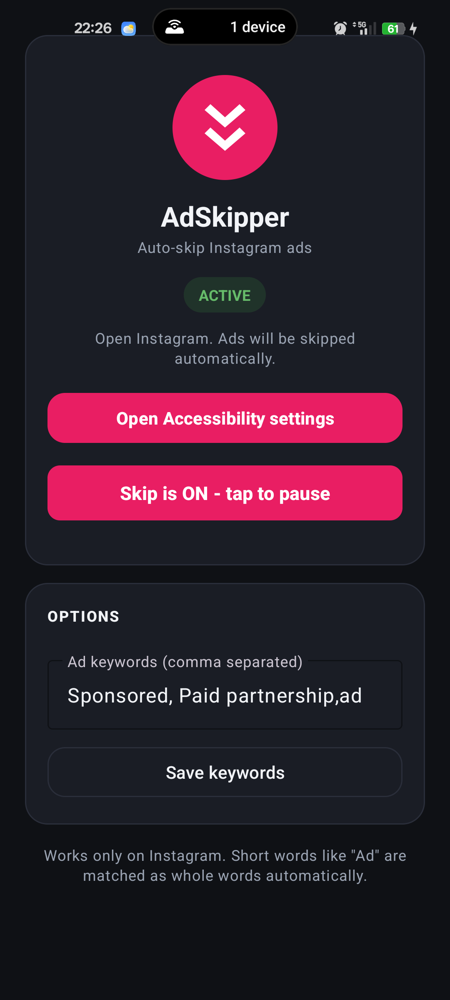

# Insta AdSkipper

AdSkipper is a small Android app that uses an accessibility service to skip sponsored Instagram content while you scroll.

I made it for personal use because Reels ads break the flow, especially when Instagram's auto scroll is running and ads keep stopping everything. The app watches the visible Instagram screen, looks for ad labels or common ad buttons, then skips in the same direction you were already moving. If you were going down, it skips down. If you were going back up, it skips up.

This is meant to help with ads, not to replace Instagram's normal scrolling. For regular Reels, Instagram does not expose a reliable video duration through accessibility. The app would either have to guess and skip too early, or wait on a manual timer that feels bad. Instagram already has auto scroll for normal videos, so this app stays focused on the annoying part: ads.

## pictures



## what it handles

- Instagram Reels
- Instagram Stories
- The main feed when an ad marker is visible
- Forward and backward scrolling
- Instagram's own auto scroll, when it lands on an ad
- Custom ad keywords from the app screen

## what it does not do

This is not a modified Instagram APK. It does not patch Instagram, hook its process, root the phone, or block network requests.

It also does not auto scroll normal Reels. That sounds easy, but it is messy in practice because the app cannot reliably know how long each video is. Instagram's own auto scroll already handles that better.

AdSkipper only uses Android Accessibility APIs. That means it reacts after Instagram draws something on screen, so the result depends on what Instagram exposes through accessibility on your phone.

## build

This project uses Gradle and Kotlin.

```powershell
$env:JAVA_HOME='C:\Program Files\Android\Android Studio\jbr'
$env:PATH="$env:JAVA_HOME\bin;$env:PATH"
.\gradlew.bat assembleDebug
```

The debug APK will be created at:

```text
app/build/outputs/apk/debug/app-debug.apk
```

## setup on phone

Install the APK, open the app, then enable "AdSkipper" in Android Accessibility settings.

After that, open Instagram and scroll normally, or turn on Instagram's auto scroll. The app only runs its skip logic when Instagram is the foreground app.

## privacy

The app has no internet permission and does not send data anywhere. It stores only local settings, such as whether skipping is enabled and which keywords should count as ad markers.

## notes

Instagram changes its UI often. If skipping stops working, the first thing to check is whether Instagram changed the text labels or view ids exposed to accessibility.
